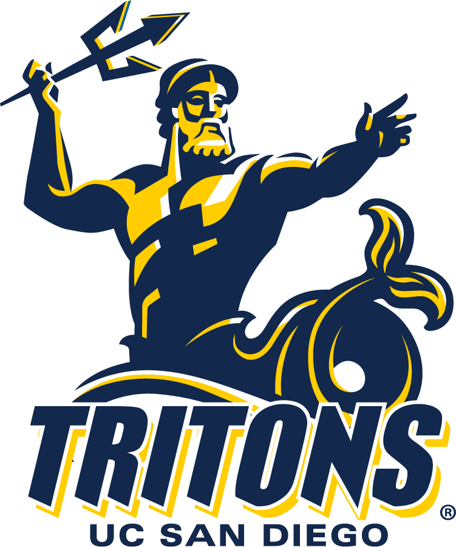

## All About Me

Hello, my name is Travis Henry, and I go to **University of California, San Diego** as a second year __computer science major__.



As a part of Muir College, I love to to live by their motto:

>Celebrating the Independent Spirit


My favorite coding language is Python!
```
print('wow this is so much easier')

```

For other coding languages I know see [here!](#skills!)

And here's my [linkedin](https://www.linkedin.com/in/travis-henry-1b53a6330/)!

## Skills!

* Python
* Java
* C
* HTML
* Linear Algebra

And I'm also a big pokemon fan!

## My Favorite Ghost Pokemon
1. Mega Gengar
2. Dragapult
3. Marshadow
4. Blacepheleon
5. Chandelure
6. Annilhape
7. Cursola
8. Ceruledge
9. Basculgion
10. Hisuian Zoroark


don't [click](/secret.md) me!

## Goals!
- [x] get good at java
- [x] get good at python
- [x] get good at C
- [x] get good at showering everyday
- [ ] get good at software engineering
- [ ] get good at javascript
- [ ] get an internship
- [ ] get a job
- [ ] get a girlfriend

[Back to the top!](#all-about-me)

